[](https://www.udacity.com/robotics)

# Project: Perception Pick & Place

Writeup by Peng Xu

Date: Nov 2018

---

## 1. Overview

In this project, you must assimilate your work from previous exercises to successfully complete a tabletop pick and place operation using PR2. The PR2 has been outfitted with an RGB-D sensor much like the one you used in previous exercises. This sensor however is a bit noisy much like real sensors.

Given a cluttered tabletop scenario, you must implement a perception pipeline using your work from Exercises 1, 2 and 3 to identify target objects from a so-called “Pick-List” in a particular order, pick up those objects and place them in corresponding dropboxes.

## 2. Implementation

### Exercise 1 Pipeline: Filtering and RANSAC Plane fitting.

The steps are the following:

- Downsample the point cloud by applying a Voxel Grid Filter.
- Apply a Passthrough Filter to isolate the table and objects.
- Perform RANSAC plane fitting to identify the table.
- Use the Passthrough Filter to create new point clouds containing the table and objects separately.

**Raw Data**

Provided a saved point cloud, tabletop.pcd, as shown below, we aimed to separate the table top and the objects.

- Table.pcd - Containing only the points that belong to the table
- Objects.pcd - Containing all the tabletop objects

<p align="center"> 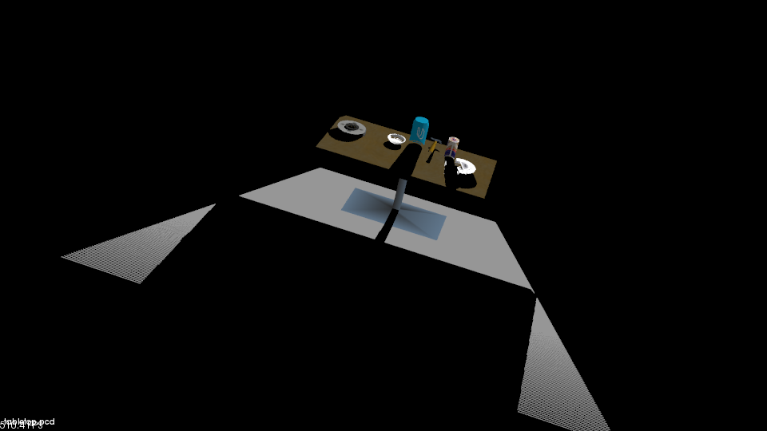 </p>

**Downsample with a Voxel Grid Filter**

RGB-D cameras provide feature rich and particularly dense point clouds, meaning, more points are packed in per unit volume than, for example, a Lidar point cloud. Running computation on a full resolution point cloud can be slow and may not yield any improvement on results obtained using a more sparsely sampled point cloud.

In the case, it is advantageous to downsample the data. A VoxelGrid Downsampling Filter is used to derive a point cloud that has fewer points but should still do a good job of representing the input point cloud as a whole.

<p align="center"> 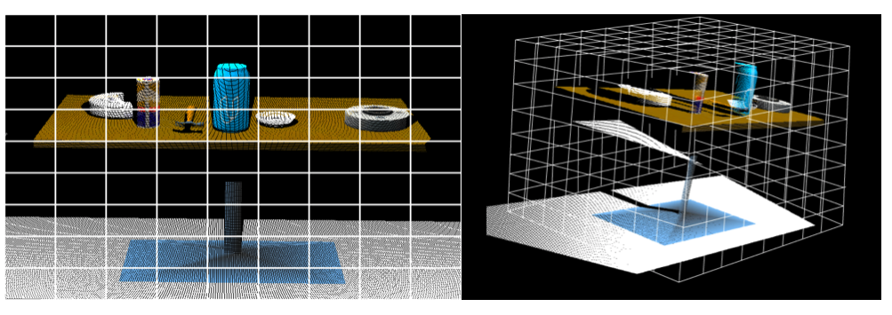 </p>

The word "pixel" is short for "picture element". Similarly, the word "voxel" is short for "volume element". Just as you can divide the 2D image into a regular grid of area elements, as shown in the image on the left above, you can divide up your 3D point cloud, into a regular 3D grid of volume elements as shown on the right. Each individual cell in the grid is now a voxel and the 3D grid is known as a "voxel grid".

A voxel grid filter allows you to downsample the data by taking a spatial average of the points in the cloud confined by each voxel. You can adjust the sampling size by setting the voxel size along each dimension. The set of points which lie within the bounds of a voxel are assigned to that voxel and statistically combined into one output point.

<p align="center"> 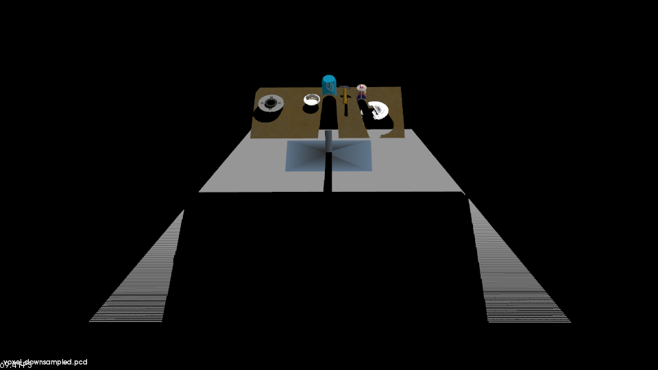 </p>

The code is as below,

```python
# Create a VoxelGrid filter object for our input point cloud
vox = pcl_data.make_voxel_grid_filter()

# Choose a voxel (also known as leaf) size
# Note: this (1) is a poor choice of leaf size
# Experiment and find the appropriate size!
LEAF_SIZE = 0.0025

# Set the voxel (or leaf) size
vox.set_leaf_size(LEAF_SIZE, LEAF_SIZE, LEAF_SIZE)

# Call the filter function to obtain the resultant downsampled point cloud
cloud_filtered = vox.filter()
```

**Remain table top and object Cloud with a Passthrough Filter**

The Pass Through Filter works much like a cropping tool, which allows you to crop any given 3D point cloud by specifying an axis with cut-off values along that axis. The region you allow to pass through, is often referred to as **region of interest**.

For instance, in our tabletop scene we know that the table is roughly in the center of our robot’s field of view. Hence by using a Pass Through Filter we can select a region of interest to remove some of the excess data.

Applying a Pass Through filter along z axis (the height with respect to the ground) to our tabletop scene in the range 0.6 to 1.1 and along y axis in the range -2.0 to -1.4 gives the following result:

<p align="center"> 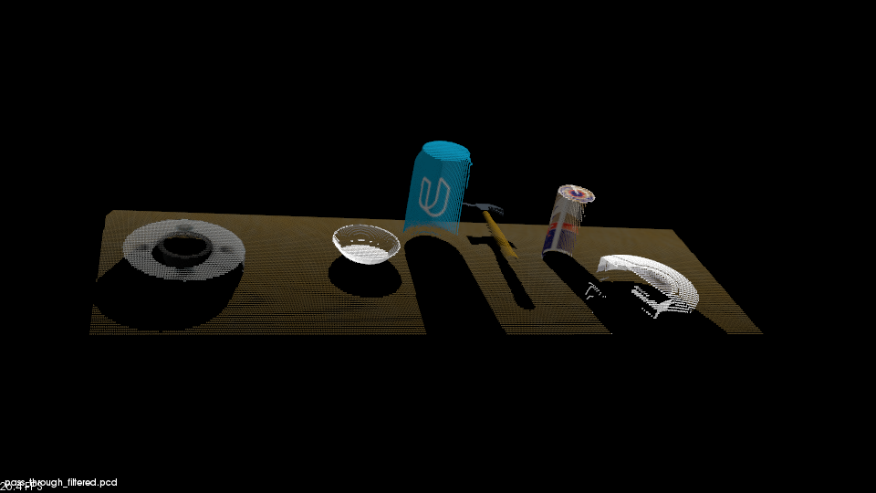 </p>

Well, it looks good. Only the table top and the objects were remained.

The code is as below,

```Python
# Filter in z direction
# PassThrough filter
# Create a PassThrough filter object.
passthrough = cloud_filtered.make_passthrough_filter()

# Assign axis and range to the passthrough filter object.
filter_axis = 'z'
passthrough.set_filter_field_name(filter_axis)
axis_min = 0.6
axis_max = 1.1
passthrough.set_filter_limits(axis_min, axis_max)

# Finally use the filter function to obtain the resultant point cloud.
cloud_filtered = passthrough.filter()

# Filter in z direction
# PassThrough filter
# Create a PassThrough filter object.
passthrough = cloud_filtered.make_passthrough_filter()

# Assign axis and range to the passthrough filter object.
filter_axis = 'y'
passthrough.set_filter_field_name(filter_axis)
axis_min = -2.0
axis_max = -1.4
passthrough.set_filter_limits(axis_min, axis_max)

# Finally use the filter function to obtain the resultant point cloud.
cloud_filtered = passthrough.filter()
```

**Isolate table top with RANSAC plane fitting**

Random Sample Consensus or "RANSAC" is an algorithm, that you can use to identify points in the dataset that belong to a particular model. In the case of the 3D scene, the model could be a plane, a cylinder, a box, or any other common shape.

The RANSAC algorithm assumes that all of the data in a dataset is composed of both inliers and outliers, where inliers can be defined by a particular model with a specific set of parameters, while outliers do not fit that model and hence can be discarded.

With a prior knowledge of a certain shape being present in a given data set, we can use RANSAC to estimate what pieces of the point cloud set belong to that shape by assuming a particular model.

By modeling the table as a plane, we can remove it from the point cloud to obtain the following result:

<p align="center"> 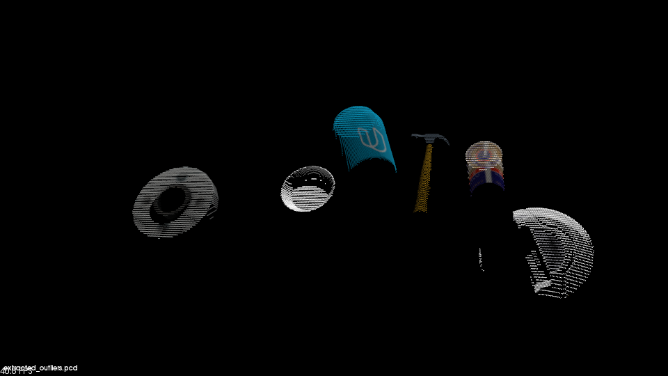 </p>

Since the top of the table in the scene is the single most prominent plane, after ground removal, we can effectively use RANSAC to identify points that belong to the table and discard/filter out those points. As a result, only the table top remains in the point cloud as shown below,

<p align="center"> 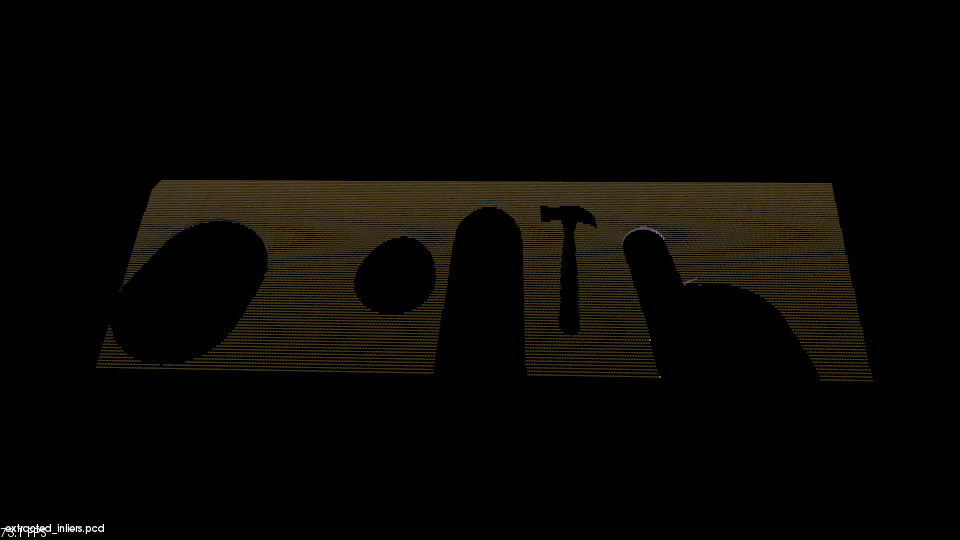 </p>

Below is the code,

```python
# Create the segmentation object
seg = cloud_filtered.make_segmenter()

# Set the model you wish to fit
seg.set_model_type(pcl.SACMODEL_PLANE)
seg.set_method_type(pcl.SAC_RANSAC)

# Max distance for a point to be considered fitting the model
# Experiment with different values for max_distance
# for segmenting the table
max_distance = 0.01
seg.set_distance_threshold(max_distance)

# Call the segment function to obtain set of inlier indices and model coefficients
inliers, coefficients = seg.segment()

extracted_inliers = cloud_filtered.extract(inliers, negative=False) # table top
extracted_outliers = cloud_filtered.extract(inliers, negative=True) # objects
```

### Exercise 2 Pipeline: clustering for segmentation.

- Add clustering for segmentation to the pipeline.
- Create a python ros node that subscribes to /sensor_stick/point_cloud topic.
- Create publishers and topics to publish the segmented table and tabletop objects as separate point clouds
- Apply Euclidean clustering on the table-top objects

#### Create a python ros node that subscribes to /sensor_stick/point_cloud topic.

```python
pcl_sub = rospy.Subscriber("/sensor_stick/point_cloud", pc2.PointCloud2, pcl_callback, queue_size=1)
```

#### Create publishers and topics to publish the segmented table and tabletop objects as separate point clouds

```python
pcl_objects_pub = rospy.Publisher("/pcl_objects", PointCloud2, queue_size=1)
pcl_table_pub = rospy.Publisher("/pcl_table", PointCloud2, queue_size=1)
pcl_cluster_pub = rospy.Publisher("/pcl_cluster", PointCloud2, queue_size=1)
```

#### Add clustering for segmentation to the pipeline

Transfer code in exercise 1 into pcl_callback(). Up to now, we can already check the cloud of the objects and the table top in rvz.

<p align="center"> 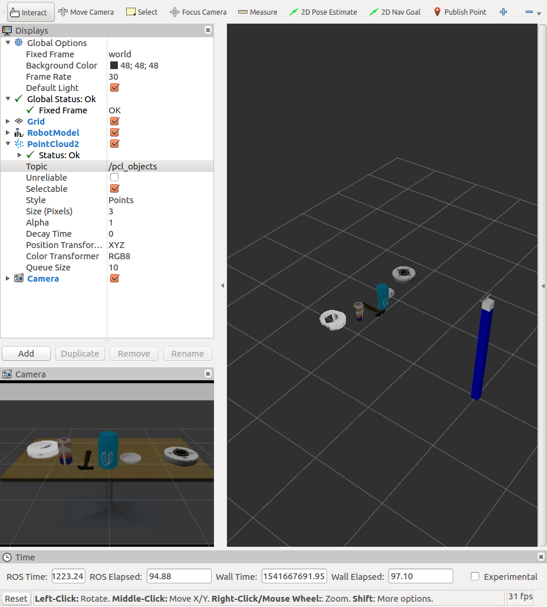 </p>

<p align="center"> 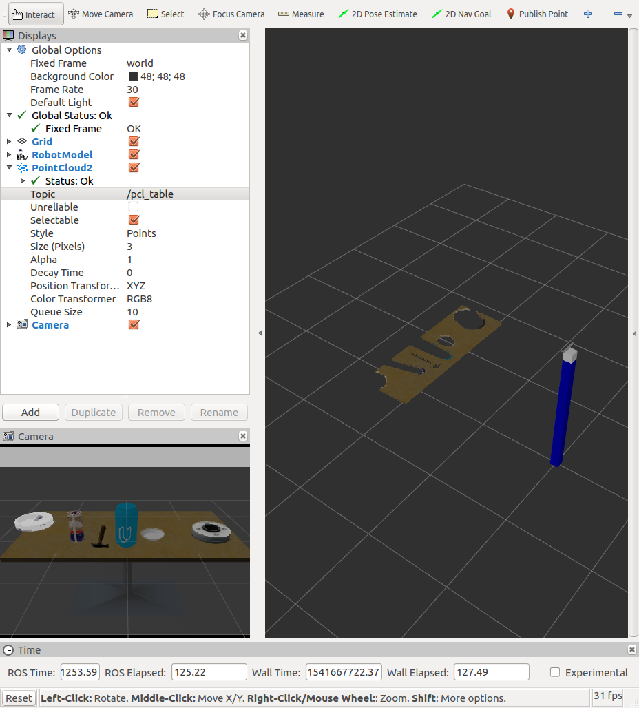 </p>

Then we use Euclidean Clustering algorithm to cluster the cloud of the objects. For each cluster, we assign different color to it. After transform the cloud to ros message, we publish them to the topic "pcl_clusters"

```python
# TODO: Euclidean Clustering
white_cloud = XYZRGB_to_XYZ(extracted_outliers) # Apply function to convert XYZRGB to XYZ
tree = white_cloud.make_kdtree()

# TODO: Create Cluster-Mask Point Cloud to visualize each cluster separately
# Create a cluster extraction object
ec = white_cloud.make_EuclideanClusterExtraction()
# Set tolerances for distance threshold
# as well as minimum and maximum cluster size (in points)
# NOTE: These are poor choices of clustering parameters
# Your task is to experiment and find values that work for segmenting objects.
ec.set_ClusterTolerance(0.02)
ec.set_MinClusterSize(20)
ec.set_MaxClusterSize(10000)
# Search the k-d tree for clusters
ec.set_SearchMethod(tree)
# Extract indices for each of the discovered clusters
cluster_indices = ec.Extract()

#Assign a color corresponding to each segmented object in scene
cluster_color = get_color_list(len(cluster_indices))

color_cluster_point_list = []

for j, indices in enumerate(cluster_indices):
    for i, indice in enumerate(indices):
        color_cluster_point_list.append([white_cloud[indice][0],
                                         white_cloud[indice][1],
                                         white_cloud[indice][2],
                                         rgb_to_float(cluster_color[j])])

#Create new cloud containing all clusters, each with unique color
cluster_cloud = pcl.PointCloud_PointXYZRGB()
cluster_cloud.from_list(color_cluster_point_list)

# TODO: Convert PCL data to ROS messages
ros_cloud_objects = pcl_to_ros(extracted_outliers)
ros_cloud_table = pcl_to_ros(extracted_inliers)
ros_cluster_cloud = pcl_to_ros(cluster_cloud)

# TODO: Publish ROS messages
pcl_objects_pub.publish(ros_cloud_objects)
pcl_table_pub.publish(ros_cloud_table)
pcl_cluster_pub.publish(ros_cluster_cloud)
```

The clouds of clusters are as shown below in Rviz.

<p align="center"> 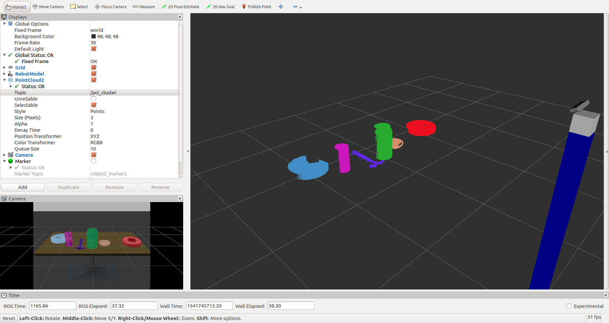 </p>

### Exercise 3 Pipeline: Features extraction, SVM model training and object recognition.

- Extract color and normal histogram features and train an SVM linear classifier.

- Populate the compute_color_histograms() and compute_normal_histograms() functions within features.py in /sensor_stick/src/sensor_stick to generate correct histogram results.

#### Feature extraction

The color features are constructed like This

```python
# TODO: Compute histograms
x_hist = np.histogram(channel_1_vals, bins=32, range=(0, 256))
y_hist = np.histogram(channel_2_vals, bins=32, range=(0, 256))
z_hist = np.histogram(channel_3_vals, bins=32, range=(0, 256))

# TODO: Concatenate and normalize the histograms
hist_features = np.concatenate((x_hist[0], y_hist[0], z_hist[0])).astype(np.float64)
```

Similarly, the normal features are like

```python
# TODO: Compute histograms of normal values (just like with color)
x_hist = np.histogram(norm_x_vals, bins=32, range=(-1.0, 1.0))
y_hist = np.histogram(norm_y_vals, bins=32, range=(-1.0, 1.0))
z_hist = np.histogram(norm_z_vals, bins=32, range=(-1.0, 1.0))

# TODO: Concatenate and normalize the histograms
hist_features = np.concatenate((x_hist[0], y_hist[0], z_hist[0])).astype(np.float64)
```

Bring up the gazebo environment with,

```bash
roslaunch sensor_stick training.launch
```

Run the feature extraction command by

```bash
rosrun sensor_stick capture_features.py
```

#### Tain a SVM classifier

Run

```bash
rosrun sensor_stick train_svm.py
```

Then we get_param

<p align="center"> 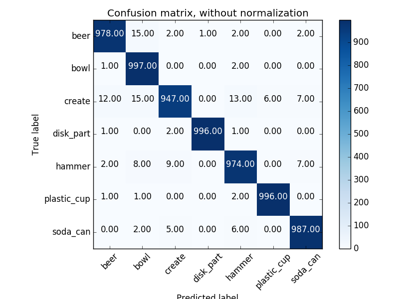 </p>

<p align="center"> 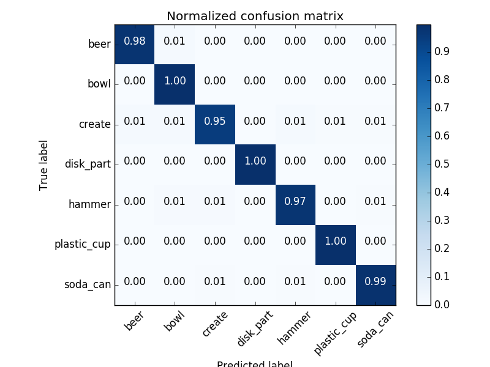 </p>

which shows high accuracies after capturing 1000 samples for each object.

#### Object recognition

Bring up the gazebo environment with,

```bash
roslaunch sensor_stick robot_spawn.launch
```

Run the object recognition command by

```bash
rosrun sensor_stick object_recognition.py
```

<p align="center"> 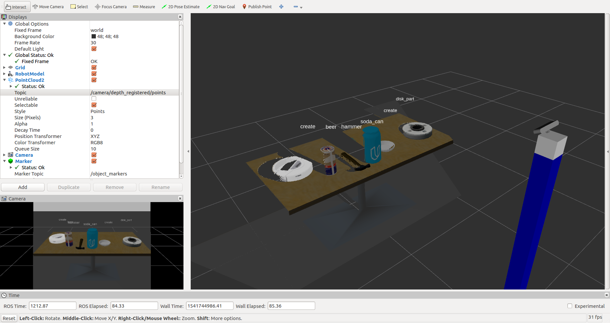 </p>

<p align="center"> 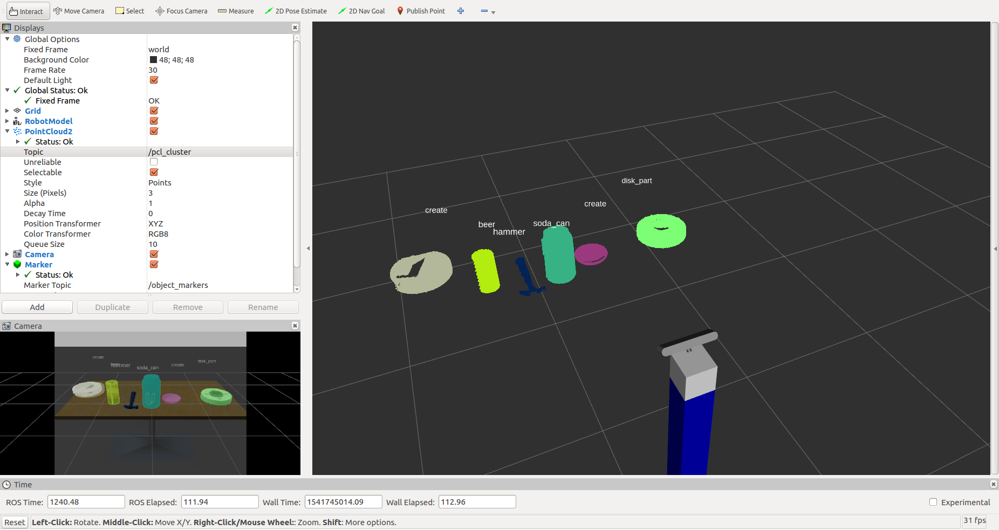 </p>

As the images above shown, the recognition performs well with 100% success rate.

### Pick and Place Setup

For all three tabletop setups (`test*.world`), perform object recognition, then read in respective pick list (`pick_list_*.yaml`). Next construct the messages that would comprise a valid `PickPlace` request output them to `.yaml` format.

#### creating a ROS node to subscribe the cloud

```python
    pcl_sub = rospy.Subscriber("/pr2/world/points", pc2.PointCloud2, pcl_callback, queue_size=1)
```

### Test the worlds

To test with the project, first run:

```bash
$ roslaunch pr2_robot pick_place_project.launch
```

and then,

```bash
$ rosrun pr2_robot project_pipeline.py
```

#### Test 1 World

The object list is as followed,

```
object_list:
  - name: biscuits
    group: green
  - name: soap
    group: green
  - name: soap2
    group: red
```

The training result

<p align="center"> 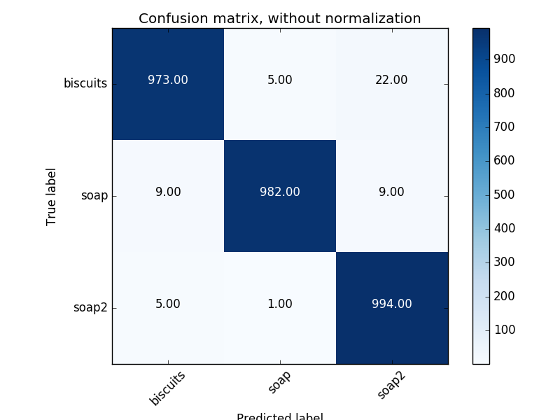 </p>

<p align="center"> 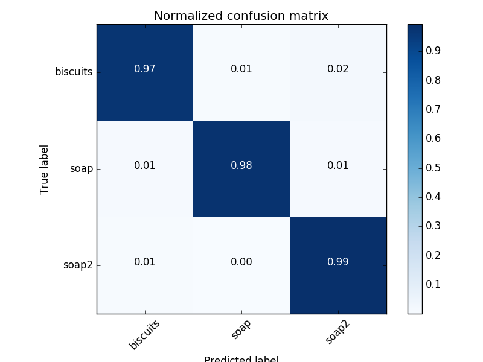 </p>

As in *output_1.yaml* and the rviz display as shown below, *biscuits, soap and soap2* are recognized correctly which means 100% accuracy.

<p align="center"> 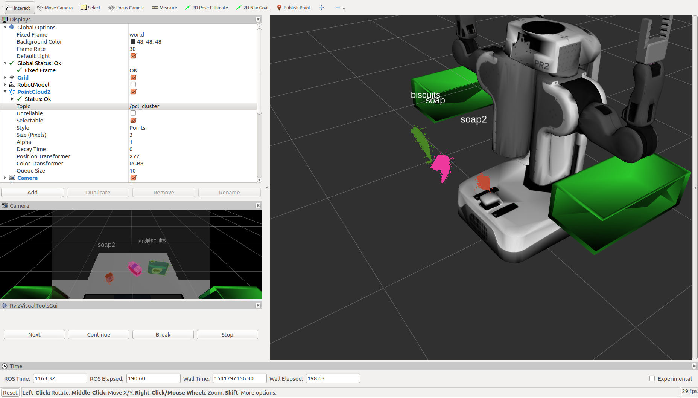 </p>

#### Test 2 World

The object list is as followed,

```
object_list:
  - name: biscuits
    group: green
  - name: soap
    group: green
  - name: book
    group: red
  - name: soap2
    group: red
  - name: glue
    group: red
```

The training result

<p align="center"> 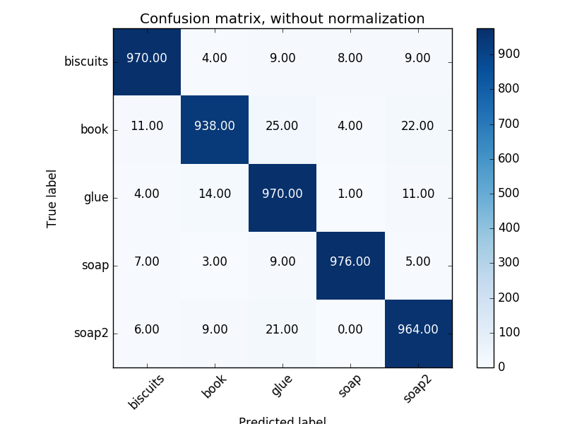 </p>

<p align="center">  </p>

As in *output_2.yaml* and the rviz display as shown below, *biscuits, soap, book and soap2* are recognized correctly which means 80% accuracy.

<p align="center"> 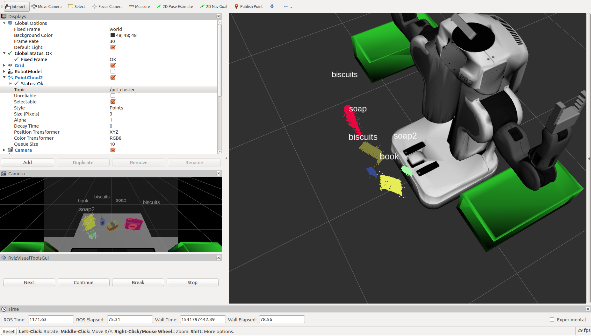 </p>

#### Test 3 World

The object list is as followed,

```
object_list:
  - name: sticky_notes
    group: red
  - name: book
    group: red
  - name: snacks
    group: green
  - name: biscuits
    group: green
  - name: eraser
    group: red
  - name: soap2
    group: green
  - name: soap
    group: green
  - name: glue
    group: red
```

The training result

<p align="center"> 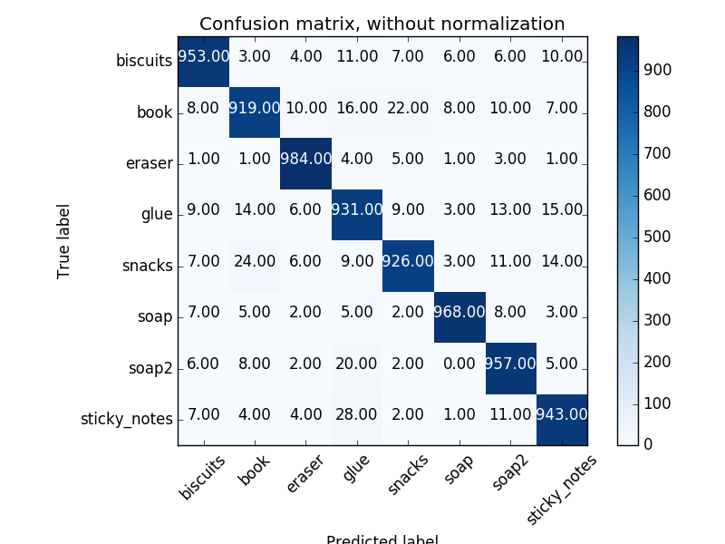 </p>

<p align="center">  </p>

As in *output_3.yaml* and the rviz display as shown below, *sticky_notes, book, snacks, biscuits, eraser, soap and soap2* are recognized correctly which means 87.5% accuracy.

<p align="center"> 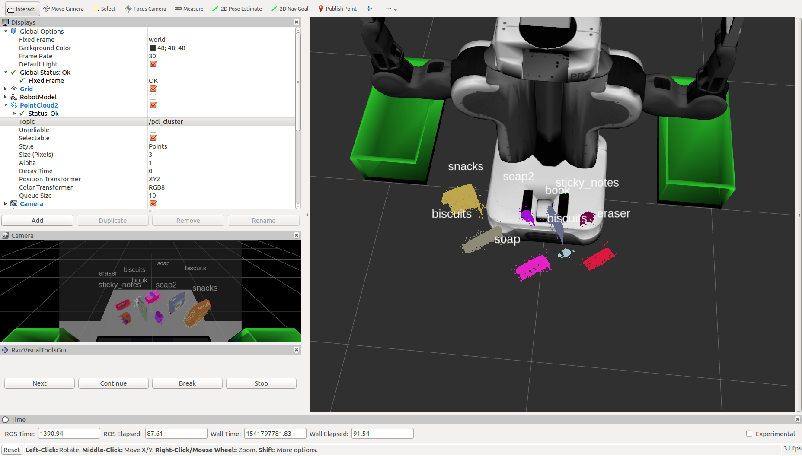 </p>

## 3. Future work

- Clear better the outliers
- Keep higher probability recognising an object.


